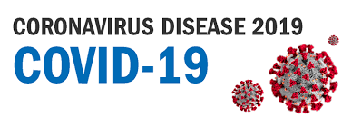

<!-- PROJECT SHIELDS -->

[![Contributors][contributors-shield]][contributors-url]
[![Forks][forks-shield]][forks-url]
[![Issues][issues-shield]][issues-url]


<!-- PROJECT LOGO -->
<br />
<p align="center">
  <a href="https://github.com/AmineDiro/Prediction-COVID19-France-">
    
  </a>

  <h3 align="center">Prediction COVID19 France</h3>

  <p align="center">
    Ce projet a pour but d'apporter une approche de data science pour prédire le développement du virus COVID19 en France.
  </p>
</p>


<!-- TABLE OF CONTENTS -->
## Table of Contents

* [A propos du projet](#A-propos-du-projet)
* [Auteurs](#Auteurs)
* [Le COVID19](#COVID19)
  * [Wiki](#prerequisites)
  * [Dataset](#installation)
* [Exploratory data analysis](#eda)
* [Comprendre l'exponentiel](#exp)
* [Prediction](#prediction)
  * [Regression Linéaire](#regression)
  * [LSTM](#LSTM)
* [Sources](#acknowledgements)


<!-- ABOUT THE PROJECT -->
## A propos du projet


## Auteurs

* [@AmineDiro](https://https://github.com/AmineDiro)
* [@RedhaL](https://github.com/RedhaL)


<!-- COVID19 -->
## Le COVID-19

### Wiki
La maladie à coronavirus 20191,2, abrégée en COVID-19 (acronyme anglais signifiant coronavirus disease 2019), est une maladie infectieuse émergente de type zoonose virale, provoquée par le coronavirus SARS-CoV-2 (ex 2019-nCoV)3, responsable d'une pandémie ayant débuté en décembre 2019 dans la ville de Wuhan, capitale de la province du Hubei, en Chine centrale.

Au mois de décembre 2019, plusieurs personnes travaillant au marché de gros de fruits de mer de Huanan sont hospitalisées à l'hôpital de Wuhan pour pneumopathie4. Le 21 décembre, les médecins de l'étude5, en utilisant un kit de diagnostic biologique ciblant 22 germes pathogènes respiratoires (18 virus et 4 bactéries) dont le résultat s'avère négatif, réalisent qu'ils sont en présence d'un nouvel agent pathogène respiratoire5.

La COVID-19 est citée comme pouvant être la « maladie X », nom donné en 2018 par l'OMS à une maladie susceptible de causer un danger international. De fait, dans les premiers mois de l'année 2020, la COVID-19, qualifiée de pandémie par l'OMS9, prend une envergure mondiale, touchant sévèrement des pays comme l'Italie, intégralement mise en quarantaine en mars, provoquant des annulations en série de manifestations sportives et autre, menaçant l'économie mondiale, déclenchant des mesures exceptionnelles comme l'interdiction faite à tous les citoyens de l'espace Schengen d'entrer sur le territoire des États-Unis, décrétée par le président Donald Trump9, et provoquant un krach boursier en Europe et en Amérique du nord le 12 mars 2020.

### Kaggle Dataset
 
1. Clone the repo
```sh
git clone https://github.com/github_username/repo.git
```
2. Install NPM packages
```sh
npm install
```


<!-- Exploratory data analysis -->
## Exploratory data analysis

Use


<!-- Comprendre l'exponentiel -->
## Comprendre l'exponentiel

Watch : https://www.youtube.com/watch?v=Kas0tIxDvrg


<!-- Prediction -->
## Prediction
### Premier Modele : Régression linéaire

Contributions 

1. Fork the Project

### Deuxième Modele : LSTM 


<!-- Sources -->
## Sources

* []()
* []()
* []()


<!-- MARKDOWN LINKS & IMAGES -->
<!-- https://www.markdownguide.org/basic-syntax/#reference-style-links -->
[contributors-shield]: https://img.shields.io/github/contributors/othneildrew/Best-README-Template.svg?style=flat-square
[contributors-url]: https://github.com/othneildrew/Best-README-Template/graphs/contributors
[forks-shield]: https://img.shields.io/github/forks/othneildrew/Best-README-Template.svg?style=flat-square
[forks-url]: https://github.com/othneildrew/Best-README-Template/network/members
[stars-shield]: https://img.shields.io/github/stars/othneildrew/Best-README-Template.svg?style=flat-square
[stars-url]: https://github.com/othneildrew/Best-README-Template/stargazers
[issues-shield]: https://img.shields.io/github/issues/othneildrew/Best-README-Template.svg?style=flat-square
[issues-url]: https://github.com/othneildrew/Best-README-Template/issues
[license-shield]: https://img.shields.io/github/license/othneildrew/Best-README-Template.svg?style=flat-square
[license-url]: https://github.com/othneildrew/Best-README-Template/blob/master/LICENSE.txt
[linkedin-shield]: https://img.shields.io/badge/-LinkedIn-black.svg?style=flat-square&logo=linkedin&colorB=555
[linkedin-url]: https://linkedin.com/in/othneildrew
[product-screenshot]: images/screenshot.png
